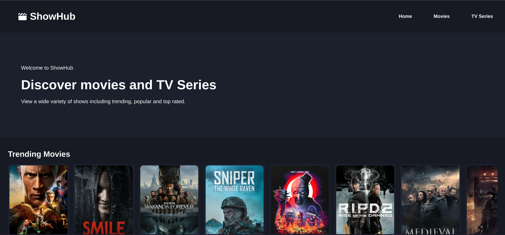

# ShowHub

Movies and TV Series catalogue that displays current, trending and top rated shows.

## Screenshot

## Features

- React (Vite, hooks)
- styled-components
- Trending, top rated and popular shows

## Installation

1. Clone repository
2. Install dependencies `npm`
3. Create .env file
4. Populate API keys
5. Run dev server `npm run dev`

HOW TO OBTAIN:
- (https://developers.themoviedb.org/3/getting-started/introduction)
